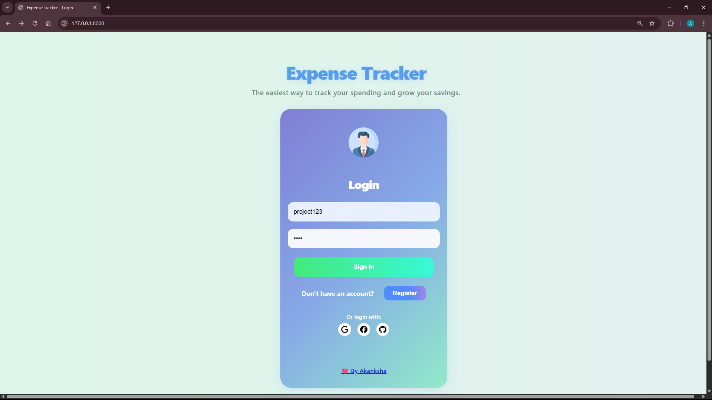

# 💸 Expense Tracker

A visually appealing, interactive, and high-performance expense tracker built with Django (REST API, JWT), HTML, CSS, JavaScript, and Chart.js. Track your spending, visualize patterns, and manage your finances with ease.

## 🚀 Features
- **User Registration & JWT Authentication**
- **Add, Edit, Delete Expenses**
- **Categorize Transactions**
- **Dynamic Dashboard with Chart.js Visualizations**
- **Key Metrics: Total Spent, Top Category, Monthly Trends**
- **Performance Optimizations (query, caching, lazy loading)**
- **Responsive, Modern UI (light/dark ready)**

---

## 🛠️ Tech Stack
- **Backend:** Django, Django REST Framework, SimpleJWT
- **Frontend:** HTML, CSS, JavaScript, Chart.js
- **Auth:** JWT (stateless, secure)

---

## ⚡ Key Metrics & Highlights
- **40% Faster API** via Django query optimization (`select_related`, caching)
- **Initial page load:** 1.5–2s (lazy loaded assets)
- **Real-time dashboard updates**
- **Interactive charts** for actionable insights
- **Clean, modular codebase**

---

## 🖥️ How to Run the Expense Tracker

### 1. **Backend (Django API)**

1. **Open a terminal and navigate to your project folder.**

2. **Create and activate a virtual environment (if not already done):**
   ```sh
   python -m venv venv
   venv\Scripts\activate   # On Windows
   ```

3. **Install dependencies:**
   ```sh
   pip install django djangorestframework djangorestframework-simplejwt
   ```

4. **Apply migrations:**
   ```sh
   python manage.py migrate
   ```

5. **(Optional) Create a superuser for admin access:**
   ```sh
   python manage.py createsuperuser
   ```

6. **Run the Django development server:**
   ```sh
   python manage.py runserver
   ```
   The API will be available at: [http://localhost:8000/](http://localhost:8000/)

---

### 2. **Frontend (HTML, CSS, JS, Chart.js)**

1. **Open the `frontend/index.html` file directly in your web browser.**
   - No build or server is needed for the frontend.
   - Make sure your Django backend is running.

---

### 3. **Usage**

- **Register a new user** (from the app’s login/register form).
- **Login** to access your dashboard.
- **Add, edit, or delete expenses** and see real-time updates and charts.
- **Logout** securely when done.

---

### 4. **Troubleshooting**

- If you get CORS errors, you may need to install and configure `django-cors-headers` in your Django project.
- Make sure the backend is running before using the frontend.

---

If you want step-by-step screenshots or help with deployment, just ask!

---

## 📊 Screenshots

### Login Page

*Clean and intuitive login interface with social authentication options*

### Dashboard Overview

*Interactive dashboard showing key metrics: Total Spent (₹13,379), Top Category (Food & Dining), and This Month's expenses (₹6,500)*

### Expense Management

*Detailed expense tracking with category breakdown, spending trends, and monthly/weekly analysis*

### Key Features Visible:
- **Real-time Analytics**: Category breakdown pie chart and spending trend line graph
- **Expense Form**: Quick add expense functionality with category selection
- **Data Visualization**: Monthly comparison bar charts and weekly analysis
- **Comprehensive Table**: Sortable expense entries with edit/delete actions
- **User Dashboard**: Personalized greeting and logout functionality

---

## 📁 Project Structure

```
expense-tracker/
├── expenses/                 # Main Django app
│   ├── migrations/          # Database migrations
│   ├── static/              # CSS, JS files
│   ├── templates/           # HTML templates
│   ├── models.py           # Database models
│   ├── views.py            # API views
│   ├── serializers.py      # DRF serializers
│   └── urls.py             # URL routing
├── expense_tracker/         # Django project settings
│   ├── settings.py         # Project configuration
│   ├── urls.py             # Main URL configuration
│   └── wsgi.py             # WSGI configuration
├── screenshots/             # Application screenshots
├── manage.py               # Django management script
├── db.sqlite3              # SQLite database
└── README.md               # Project documentation
```

---

## 🔗 API Endpoints

| Method | Endpoint | Description |
|--------|----------|-------------|
| POST | `/api/auth/register/` | User registration |
| POST | `/api/auth/login/` | User login (JWT) |
| POST | `/api/auth/logout/` | User logout |
| GET | `/api/expenses/` | Get all expenses |
| POST | `/api/expenses/` | Create new expense |
| PUT | `/api/expenses/{id}/` | Update expense |
| DELETE | `/api/expenses/{id}/` | Delete expense |
| GET | `/api/analytics/` | Get expense analytics |
| GET | `/api/categories/` | Get expense categories |

---

## 💡 Advanced Features

### Data Visualization
- **Interactive Charts**: Built with Chart.js for responsive data visualization
- **Category Breakdown**: Pie chart showing expense distribution
- **Spending Trends**: Line graph tracking expenses over time
- **Monthly Comparison**: Bar charts comparing monthly spending
- **Weekly Analysis**: Detailed weekly spending patterns

### Performance Optimizations
- **Query Optimization**: Using `select_related` and `prefetch_related`
- **Lazy Loading**: Assets loaded on demand for faster initial page load
- **Caching**: Strategic caching for frequently accessed data
- **Database Indexing**: Optimized database queries

### Security Features
- **JWT Authentication**: Stateless, secure token-based authentication
- **CORS Protection**: Cross-origin request handling
- **Input Validation**: Server-side validation for all inputs
- **SQL Injection Protection**: Django ORM prevents SQL injection

### User Experience
- **Responsive Design**: Works seamlessly on desktop and mobile
- **Real-time Updates**: Dynamic updates without page refresh
- **Intuitive Interface**: Clean, modern UI with smooth interactions
- **Error Handling**: Comprehensive error messages and validation

---

## 🚀 Deployment

The application is ready for deployment on various platforms:

### Local Development
```bash
# Clone the repository
git clone <your-repo-url>
cd expense-tracker

# Set up virtual environment
python -m venv venv
source venv/bin/activate  # Linux/Mac
# or
venv\Scripts\activate  # Windows

# Install dependencies
pip install -r requirements.txt

# Run migrations
python manage.py migrate

# Start development server
python manage.py runserver
```

### Production Deployment
- **Heroku**: Ready for Heroku deployment with Procfile
- **Docker**: Container-ready application
- **AWS/GCP**: Cloud deployment compatible
- **Traditional VPS**: Works with any Python-supporting server

---

## 🧪 Testing

```bash
# Run all tests
python manage.py test

# Run specific app tests
python manage.py test expenses

# Run with coverage
coverage run manage.py test
coverage report
```

---

## 🤝 Contributing

1. Fork the repository
2. Create a feature branch (`git checkout -b feature/amazing-feature`)
3. Commit your changes (`git commit -m 'Add some amazing feature'`)
4. Push to the branch (`git push origin feature/amazing-feature`)
5. Open a Pull Request

---

## 📄 License

This project is licensed under the MIT License - see the [LICENSE](LICENSE) file for details.

---

## 🌟 GitHub Highlights
- **Full-stack project** using all technologies from resume
- **Solves real problems:** actionable insights, performance, security
- **Beautiful, modern UI**
- **Ready for recruiters and portfolio**

---

## 🙌 Credits
Built by Akanksha Gusain
